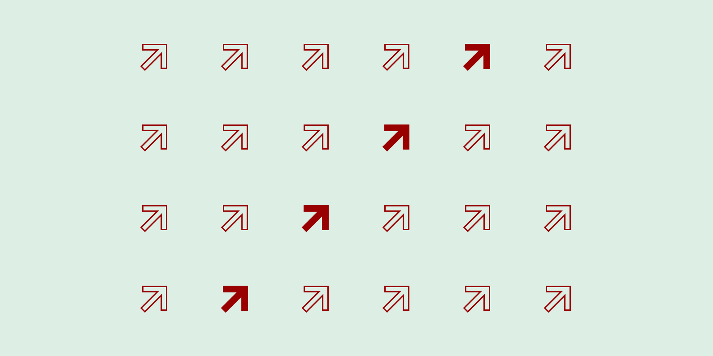

## PHPA: Poor man's Horizontal Pod Autoscaler



PHPA takes metrics from our InfluxDB and Graphite and then scales a deployment based on those metrics. 

Before building PHPA, we actually looked at [Horizontal Pod Autoscaler](https://kubernetes.io/docs/tasks/run-application/horizontal-pod-autoscale/) but we found that it only scales based on CPU and Memory usage whereas our needs were different. We wanted to scale based on metrics present in our monitoring systems (Graphite and InfluxDB). After looking into custom metrics for HPA, we figured out that it was very complicated, was mostly tied to Prometheus, didn’t have great support for Graphite, and also required knowledge of GoLang.

Also during the time, Knative was released. After looking into it, we figured out that it was still in alpha and required running multiple components, which would eventually result in operational complexity.

Hence, we decided to build *PHPA*.

# Deployment
## Service Account (One Time Setup)
- Setup `phpa-service-account` using [setup-access.yaml](./setup-access.yaml)
- Check for service account `kubectl get serviceaccount phpa-service-account`

## Deploy
At Clarisights, we run PHPA as a Kubernetes deployment in same cluster as the deployment
PHPA is auto-scaling. You can even run it as a Kubernetes CronJob.

1. Build Docker image
```sh
docker build -t phpa:latest https://github.com/clarisights/phpa.git
```
2. Push Docker image to your container registry
3. Create config map from file with your PHPA config files
```sh
kubectl create configmap phpa-configs --from-file <configs_dir>/ --dry-run -o yaml
```
4. Mount config map in your PHPA cronjob/deployment
5. Deploy

Look in [examples](./examples) folder for example configs and deployment files.

## Contributing

Clarisights uses GitHub to manage reviews of pull requests.

PHPA is written in Ruby. You need to install Ruby and Bundler - check [Dockerfile](./Dockerfile) for the instructions.

1. Fork this repo
2. Create a branch and add your features
3. Send your Pull Requests and tag contributors for review

We use [Rspec](https://rspec.info/) for testing.

#### Have questions or problems using PHPA?
- Create an issue and tag contributors

## Future Plans

Eventually, we would want to migrate PHPA to a Custom Kubernetes Controller 
and use Kubernetes CRD (CustomResourceDefinition) for PHPAConfig. 
Along with that having support for more metric server adaptors would be nice to have as well.

## Other Info
- [Slides from talk on PHPA at Bangalore Ruby Meet-up](https://docs.google.com/presentation/d/1zs-3T3XUiI6GgTaqFHNTbefZ5xaiM8ZJGGNcZ6G0EcU/edit?usp=sharing)
